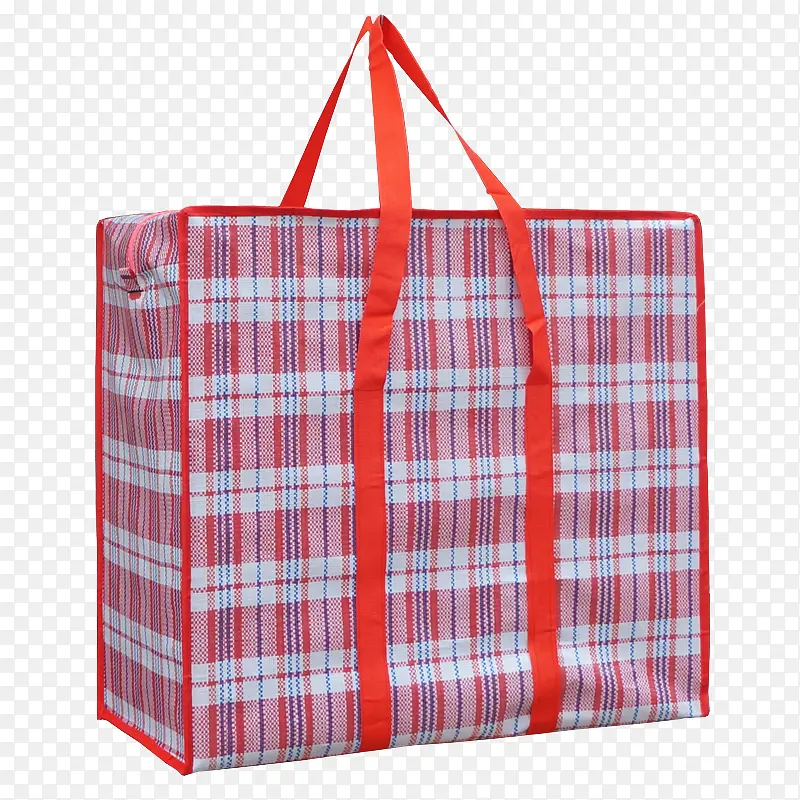
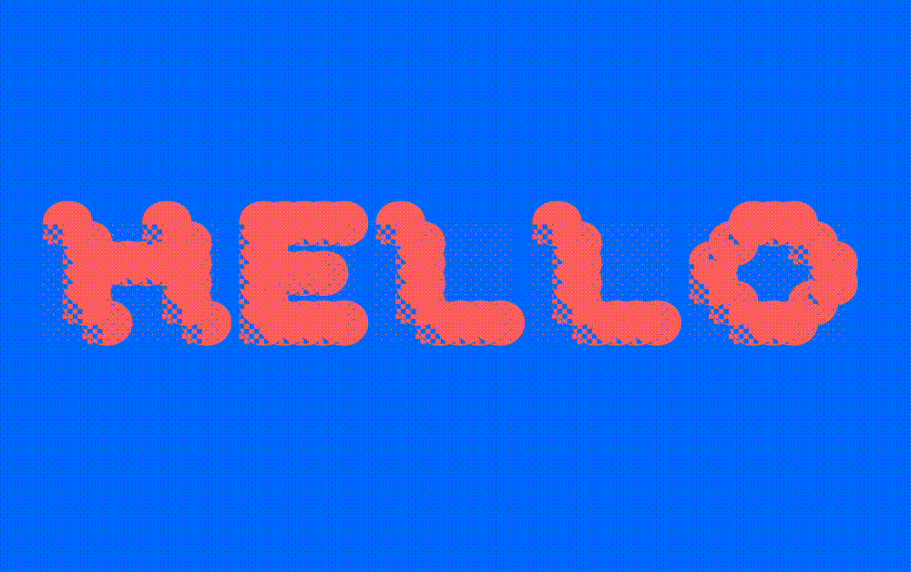

## About BianZhiDai

**BianZhiDai** is a font inspired by shading characters in ASCII art and 编织袋 (woven plastic bag in Simple Chinese). Previously constructed in [GDC](http://glyphdrawing.club) (glyphdrawingclub, designed and developed by @hlotvonen and @i-tu ), turned into modular when doing the revision. 

BianZhiDai is good with colors, especially in combination with different fill/stroke colors. Try it, and play it. Besides, the whole font is modular based, so you can customize it in [Glyphs](https://glyphsapp.com/) any way you like.

## bianzhidai 2.0 (update)
There is an update version of bianzhidai, go have a look:
[bianzhidai 2.0](https://github.com/sdfggvfvj/bianzhidai-2.0)

## Designer

[Xiaoyuan Gao](https://notyourtype.nl)

Xiaoyuan Gao is a Rotterdam-based freelance graphic designer, image-maker, type designer and the initiator of “notyourtype foundry”. In her practice, she loves experimenting with unconventional approaches to type design and typesetting. She sees type design (making custom characters into a font file) as making a tool for typing, just like a customised typewriter. She also enjoys creating visuals out of found images , which allows her to combine typography and imagery in playful ways.

## License 

Bianzhidai is licensed under the SIL Open Font License, version 1.1.

## Publisher

[Velvetyne Type Foundry](https://velvetyne.fr/)

## Co-publisher
[notyourtype foundry](https://notyourtype.nl)

## Usage Condition, Download & Install

> [!WARNING]  
> To use the "bianzhidai" font, it is mandatory to credit the designer, [Xiaoyuan Gao, notyourtype foundry](https://notyourtype.nl/) and Velvetyne Type Foundry. Acknowledging and appreciating creative contributions is essential. So, please ensure you give appropriate credit to the typeface and designer.

[By clicking this link, you agree to credit the designer. Download bianzhidai font here!](https://github.com/sdfggvfvj/bianzhidai/archive/refs/heads/main.zip)

## Reference 

## GIF

